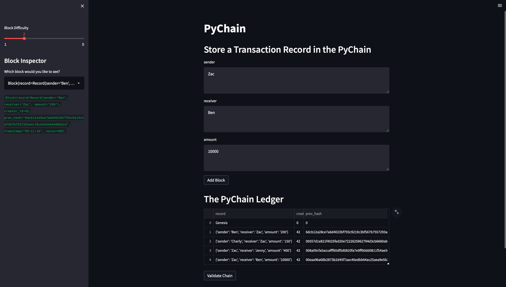
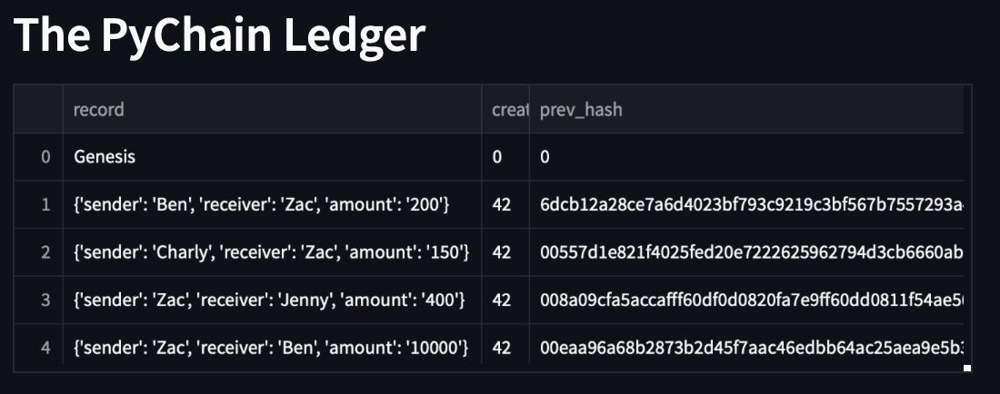
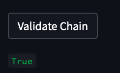
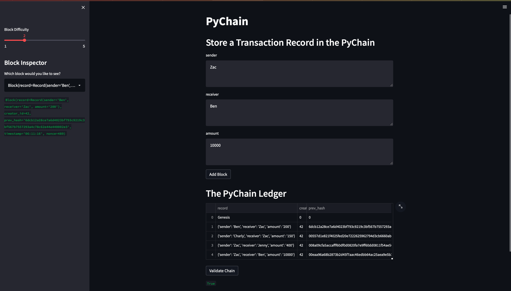

# PyChain Ledger

This is a blockchain-based ledger system, complete with a user-friendly web interface. The ledger allows participents to conduct financial transactions (that is, to transfer money between senders and receivers) and to verify the integrity of the data in the ledger.

To create a block you must enter the sender (person who is sending the money), the receiver (the person who is receiving the money), and the amount of money wanting to be transfered.

Once the block is finished it will be added to the ledger and chained up to the previous block's hashes.

We can validate the chain by pressing the `Validate Chain` button. This will check whether each block's hashes can be traced back to the orignal block and if it can then it will display `True`.

